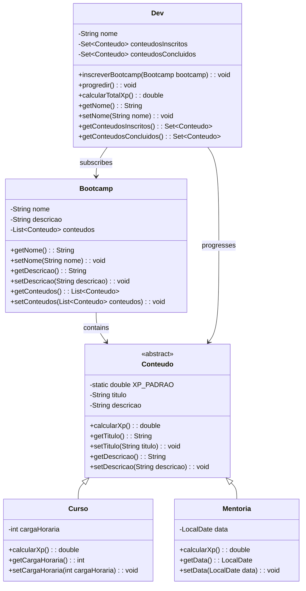

# Desafio: Aprenda na Prática Programação Orientada a Objetos

## 📖 Descrição
Este repositório contém a implementação do desafio "Aprenda na Prática Programação Orientada a Objetos" oferecido pela Digital Innovation One. O objetivo do projeto é colocar em prática os principais conceitos da Programação Orientada a Objetos (POO) em Java: Abstração, Encapsulamento, Herança e Polimorfismo, através de um projeto que modela um sistema de Bootcamp.

